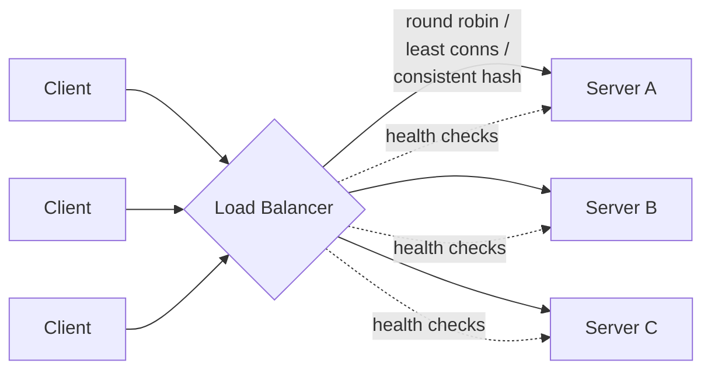

# Load balancing
{: .no_toc }

*~7 min read*

**🎯 Interview frequent**

## Why it matters

The moment you go from one server to more than one (see [scalability & availability](../01-scalability-availability/)), you need something deciding which server handles each request. Load balancers show up in nearly every system design answer, and interviewers use follow-up questions here to check whether you actually understand the mechanics (how does it pick a server, what happens on failure) rather than just drawing a box labeled "LB" in your diagram.

## Core concepts

- **Layer 4 vs. Layer 7 load balancing.** L4 balances at the transport layer (TCP/UDP) — it routes based on IP/port without looking at the actual request content, so it's fast and protocol-agnostic but can't make content-aware decisions. L7 balances at the application layer (HTTP) — it can read headers, cookies, and URL paths to route intelligently (e.g., `/api/*` to one fleet, `/static/*` to another), at the cost of more per-request overhead.
- **Load balancing algorithms.** *Round robin*: cycles through servers evenly — simple, works when servers and requests are roughly uniform. *Weighted round robin*: same idea, biased toward more powerful servers. *Least connections*: sends traffic to whichever server has the fewest active connections — better when request processing times vary a lot. *IP hash / consistent hashing*: routes the same client (or cache key) to the same server consistently — needed for session affinity or for load-balancing in front of a cache layer.
- **Health checks.** *Active* health checks poll servers on a schedule (e.g., `GET /healthz` every 5s) and pull unhealthy ones out of rotation. *Passive* health checks watch real traffic for failures (timeouts, 5xx) and react without extra polling traffic. Production systems typically use both — active checks catch a dead server before it gets real traffic, passive checks catch degradation active checks miss.
- **Sticky sessions.** Routing a given client to the same backend for the life of a session (via cookie or IP hash) lets you keep session state in server memory — but it undermines the elasticity of horizontal scaling (that server now matters more than the others) and complicates failover (killing that instance loses in-memory state). The better long-term fix is usually to externalize session state (see [caching](../04-caching/)) so any server can serve any request, making stickiness unnecessary.
- **Global vs. local load balancing.** A single load balancer handles distribution within one data center/region. Global load balancing (GeoDNS, anycast IP routing) directs users to the *nearest* healthy region entirely, before traffic ever reaches a local load balancer — this is the mechanism behind multi-region failover and low-latency global services, and it overlaps with [CDN & edge](../09-cdn-edge/).
- **The load balancer itself can't be a single point of failure.** Run it in an active-active pair (or more) behind a floating/virtual IP (e.g., via VRRP/keepalived) or use a managed, inherently redundant service (AWS ALB/NLB, GCP Load Balancer) rather than a single box you have to keep alive by hand.

## Mental model

## Interview questions

1. **What's the difference between L4 and L7 load balancing, with an example of when you'd need L7?**
   Answer: L4 routes on IP/port without inspecting the request, so it's fast but blind to content. L7 reads the actual HTTP request — you'd need it to route `/video/*` to a video-serving fleet and `/checkout/*` to a payments fleet from the same public endpoint, or to route based on a cookie for A/B testing, none of which L4 can do.

2. **When would you pick least-connections over round robin?**
   Answer: When request processing time varies significantly between requests (some take 10ms, others take 2s) — round robin would keep sending new requests to a server still busy with a slow one, causing uneven load, while least-connections naturally routes new traffic to whichever server has capacity free right now.

3. **Why might a system need consistent hashing at the load balancer layer instead of plain round robin?**
   Answer: When you need the same key (a user session, or a cache key) to consistently land on the same backend — e.g., load balancing in front of a fleet of cache servers, where hitting a different server each time would tank your cache hit rate. Consistent hashing also minimizes remapping when a server is added/removed, unlike a naive `hash(key) % N` which reshuffles almost everything when N changes.

4. **What are the tradeoffs of sticky sessions, and what's the more scalable alternative?**
   Answer: Sticky sessions let you keep session state in server memory cheaply, but they concentrate load unevenly, complicate autoscaling (you can't freely add/remove that server), and lose session data if that instance dies. The more scalable alternative is externalizing session state to a shared store (Redis, a database) so every server is interchangeable and stickiness becomes unnecessary.

5. **How does a load balancer avoid becoming a single point of failure itself?**
   Answer: Run multiple load balancer instances in active-active behind a floating IP using a protocol like VRRP/keepalived, or rely on a cloud provider's managed load balancer, which is internally redundant across zones. The general principle from [scalability & availability](../01-scalability-availability/) applies recursively — anything critical needs its own redundancy.

6. **What's the difference between active and passive health checks, and why use both?**
   Answer: Active checks proactively poll a health endpoint on a schedule, catching a dead/misconfigured server before real users hit it. Passive checks observe live traffic for errors/timeouts and react in real time, catching failure modes (slow degradation under load, a dependency timing out) that a simple health endpoint might not reflect. Using both catches more failure modes than either alone.

## Watch

- [What is a Load Balancer?](https://www.youtube.com/watch?v=sCR3SAVdyCc) — IBM Technology. Solid overview of what load balancers do and the core algorithms.
- [What is LOAD BALANCING?](https://www.youtube.com/watch?v=K0Ta65OqQkY) — Gaurav Sen. Covers L4/L7, algorithms, and health checks with system design framing.

## Further reading

- [NGINX: HTTP Load Balancing](https://docs.nginx.com/nginx/admin-guide/load-balancer/http-load-balancer/) — practical documentation of load balancing methods (round robin, least conn, IP hash).
- [AWS: How Elastic Load Balancing Works](https://docs.aws.amazon.com/elasticloadbalancing/latest/userguide/how-elastic-load-balancing-works.html) — how a managed, redundant load balancer is structured.
