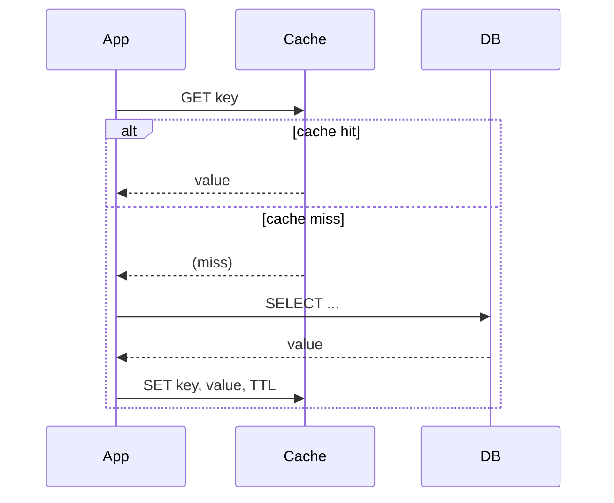

# Caching
{: .no_toc }

*~8 min read*

**🎯 Interview frequent**

## Why it matters

Caching is the highest-leverage tool for making a system feel fast and for keeping load off your database — and it's also where a lot of subtle production bugs live (stale reads, stampedes, cache/DB divergence). Interviewers lean on caching questions because the "right" answer always depends on your read/write ratio and staleness tolerance, which forces you to reason about tradeoffs instead of reciting a pattern name.

## Core concepts

- **Cache-aside (lazy loading).** The application checks the cache first; on a miss, it reads from the database and populates the cache before returning. Simplest and most common pattern — the cache only ever holds what's actually been requested, but every miss pays full DB latency, and it's on the application to keep the cache reasonably fresh (usually via TTL).
- **Write-through.** Writes go to the cache and the database together (synchronously) — reads are always fresh, but every write pays the latency of both writes, and data that's never read still occupies cache space.
- **Write-back (write-behind).** Writes go to the cache first and are asynchronously flushed to the database later. Very fast writes, but risks data loss if the cache crashes before the flush, so it needs a durable buffer or replication to be safe for anything important.
- **Read-through.** Similar to cache-aside, but the cache itself (not the application) is responsible for loading from the database on a miss — a library/infrastructure concern more than an application pattern, common in caching layers like Redis with a configured loader.
- **Eviction policies.** *LRU* (least recently used) evicts what hasn't been accessed in the longest time — good general-purpose default. *LFU* (least frequently used) evicts what's accessed least often — better when some items are consistently hot regardless of recency. *TTL* expires items after a fixed time regardless of access pattern — necessary whenever staleness has a hard bound (e.g., a price that must refresh every 60s).
- **Cache invalidation is the hard part** ("there are only two hard things in computer science..."). Strategies: TTL-based expiry (simple, but stale-until-expiry), explicit invalidation on write (fresher, but easy to miss a code path that writes without invalidating), and versioned/immutable cache keys (e.g., include a content hash or version in the key, so old and new versions coexist and you never "update" a cache entry, you just stop referencing the old key).
- **Cache stampede (thundering herd).** When a hot key expires, many concurrent requests can simultaneously miss and hammer the database to recompute the same value. Mitigations: locking/single-flight (only one request recomputes, others wait), request coalescing, staggered/jittered TTLs so keys don't all expire at once, and serving stale-while-revalidate (return the slightly-stale value while one request refreshes it in the background).
- **Where caches live.** In-process (fastest, but not shared across instances and lost on restart), a shared distributed cache like Redis/Memcached (shared across your fleet, survives individual app restarts), and a CDN (caches at the network edge, closest to the user — see [CDN & edge](../09-cdn-edge/)). Real systems layer several of these.

## Mental model

## Interview questions

1. **Compare cache-aside and write-through. When would you pick each?**
   Answer: Cache-aside only populates the cache on demand (lazy), which is efficient when many stored items are never read and reads can tolerate a first-hit penalty. Write-through keeps the cache always in sync on every write, which is worth the extra write latency when reads must always be fresh and the read path is far more latency-sensitive than the write path (e.g., a product catalog read on every page view, written rarely by comparison).

2. **What is a cache stampede and how do you prevent it?**
   Answer: A stampede happens when a popular cache key expires and many concurrent requests all miss at once, sending a burst of identical, redundant load to the database. Prevent it with a single-flight lock (first request recomputes and populates, others wait on that result instead of hitting the DB themselves), jittered TTLs so hot keys don't all expire simultaneously, or serving a stale value while one background request refreshes it.

3. **LRU vs. LFU — when does LFU actually win?**
   Answer: LRU assumes recent access predicts future access, which fails for items that are consistently popular but briefly not accessed (a evergreen "top result" that gets bumped out by a burst of one-off lookups). LFU tracks true access frequency, so it keeps genuinely hot items resident even through a temporary lull — at the cost of more bookkeeping and slower adaptation when popularity shifts.

4. **What are your main strategies for cache invalidation, and what's the failure mode of each?**
   Answer: TTL expiry is simple but guarantees a window of staleness up to the TTL. Explicit invalidation on write is fresher but fragile — any write path that forgets to invalidate leaves stale data indefinitely. Versioned/immutable keys (cache a value under a key that includes its version/hash) sidestep invalidation entirely — you just stop referencing the old key — at the cost of needing a strategy to garbage-collect old versions.

5. **In a read-heavy system, where would you put caching, and would one layer be enough?**
   Answer: Usually layered: a CDN caches static/semi-static content at the edge closest to users, a shared distributed cache (Redis) sits in front of the database for computed/query results shared across the fleet, and sometimes a small in-process cache handles extremely hot, tiny data (e.g., feature flags) to avoid even a network hop. One layer is rarely enough because each layer optimizes a different bottleneck — network latency, DB load, and per-request CPU respectively.

6. **What happens when a distributed cache node fails, and how do you minimize the blast radius?**
   Answer: Naively, every key that hashed to that node becomes a miss simultaneously, spiking DB load (a stampede across many keys at once). Consistent hashing limits the blast radius — only the keys owned by that node remap (to their next node in the hash ring), not the entire keyspace, and replicating hot keys across more than one node avoids a full miss for popular data even during a node failure.

## Watch

- [Cache Systems Every Developer Should Know](https://www.youtube.com/watch?v=dGAgxozNWFE) — ByteByteGo. Fast tour of cache-aside, write-through, write-back, and eviction policies.
- [Caching in System Design Interviews w/ Meta Staff Engineer](https://www.youtube.com/watch?v=1NngTUYPdpI) — Hello Interview. Deeper, interview-focused walkthrough including stampede mitigation and cache placement decisions.

## Further reading

- [Redis: Eviction Policies](https://redis.io/docs/latest/develop/reference/eviction/) — official documentation on LRU/LFU/TTL eviction configuration.
- [AWS: Caching Overview](https://aws.amazon.com/caching/) — patterns overview including cache-aside, write-through, and where each fits in an architecture.
