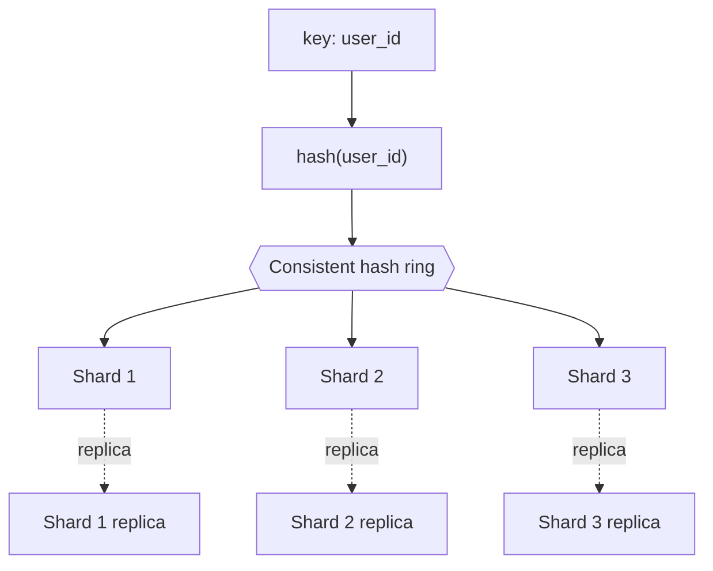

# Partitioning & sharding
{: .no_toc }

*~8 min read*

**🎯 Interview frequent**

## Why it matters

Once a dataset or write load outgrows a single machine, sharding is the standard answer — and it's also where system design interviews get genuinely hard, because a bad shard key choice quietly recreates the exact bottleneck you were trying to remove. Every case study later in this guide eventually needs to answer "how is this data partitioned," so the reasoning here is reusable across the rest of the curriculum.

## Core concepts

- **Partitioning vs. sharding vs. replication.** *Partitioning* is splitting a dataset into smaller chunks (partitions), which can happen on a single machine (e.g., partitioned tables) or across machines. *Sharding* specifically means distributing those partitions across multiple machines so each holds only a subset of the total data. *Replication* is a different, complementary axis — making copies of the *same* data on multiple machines for availability/read scaling. Real systems combine both: shard for write scale, replicate each shard for availability.
- **Choosing a shard key.** The shard key (or partition key) determines which shard a given row lives on. A good key distributes both data volume *and* access load evenly. A bad choice creates a **hotspot** — e.g., sharding by signup date means all of today's traffic hits one shard; sharding by a sequential auto-increment ID means all new writes hit the last shard. Prefer high-cardinality, access-pattern-aligned keys (e.g., user ID for a per-user workload), and consider salting/hashing sequential keys to spread writes.
- **Range-based sharding.** Each shard owns a contiguous range of key values (e.g., users A–F on shard 1). Enables efficient range queries ("all users with ID between X and Y") but is prone to hotspots if traffic or writes concentrate in one range (a currently-trending ID range, or the most recent time range in a time-partitioned table).
- **Hash-based sharding.** The shard key is hashed and the result determines the shard (e.g., `hash(user_id) % N`). Distributes load evenly and avoids hotspots from sequential access patterns, but destroys range-query locality — "all users between X and Y" now means querying every shard.
- **Directory-based sharding.** A lookup service/table maps each key (or key range) to its shard explicitly, rather than deriving it from a formula. More flexible — you can rebalance by just updating the mapping — but the directory itself becomes a critical, must-scale component and a potential single point of failure if not made highly available.
- **Consistent hashing solves the resharding problem.** With plain `hash(key) % N`, adding or removing a shard (changing N) remaps almost every key, forcing a massive data shuffle. Consistent hashing arranges shards on a hash ring so that adding/removing one shard only remaps the keys that were adjacent to it — a small fraction of the total, not everything.
- **Cross-shard operations are the real cost.** Joins, transactions, and aggregate queries that span multiple shards require the application (or a coordinating layer) to fan out to each shard and merge results, losing the database's native ability to do this efficiently in one place. This is the single biggest reason to choose a shard key carefully upfront — retrofitting one after cross-shard queries are common in production is expensive.
- **Resharding a live system is operationally hard.** It typically requires dual-writing to old and new shard layouts during a migration window, backfilling historical data, and cutting reads over once the new layout is verified consistent — all while avoiding downtime. This is one of the more common "how would you do X without downtime" follow-ups in interviews.

## Mental model

## Interview questions

1. **What's the difference between partitioning, sharding, and replication?**
   Answer: Partitioning splits data into chunks (which can be on one machine or many). Sharding is partitioning specifically across multiple machines, so each holds a distinct subset of data — it scales storage and write throughput. Replication copies the *same* data across machines for availability and read scaling. They're complementary: production systems shard for scale and replicate each shard for durability/availability.

2. **How do you choose a shard key, and what goes wrong with a bad choice?**
   Answer: A good shard key spreads both data and access load evenly and aligns with your dominant access pattern (e.g., shard by tenant/user ID if most queries are scoped to one user). A bad choice — like a monotonically increasing ID or a low-cardinality field like signup date — creates a hotspot, where one shard absorbs disproportionate traffic, recreating the exact single-node bottleneck sharding was meant to solve.

3. **Range-based vs. hash-based sharding — what do you give up with each?**
   Answer: Range-based sharding preserves efficient range queries but is prone to hotspots when access concentrates in one range (e.g., "recent" data in a time-ordered key). Hash-based sharding spreads load evenly and avoids that hotspot, but destroys locality — a range query now has to fan out to every shard instead of a contiguous few.

4. **What problem does consistent hashing solve in the context of resharding?**
   Answer: With naive `hash(key) % N` sharding, changing the number of shards (N) remaps nearly every key to a different shard, requiring a massive, disruptive data shuffle. Consistent hashing places shards on a ring so that adding or removing one shard only affects the keys immediately adjacent to it on the ring — a small, bounded fraction of total data moves instead of nearly all of it.

5. **Why are cross-shard queries and joins hard, and how do systems typically mitigate that?**
   Answer: A cross-shard join or aggregate requires querying every relevant shard individually and merging results in the application or a coordination layer, losing the single-node query optimizer's efficiency and adding latency proportional to the number of shards touched. Mitigations: choose a shard key that keeps commonly-joined data co-located (e.g., shard both tables by the same tenant ID), denormalize to avoid the join entirely, or accept the fan-out cost for genuinely rare cross-shard queries while optimizing the common path.

6. **How would you reshard a live production database without downtime?**
   Answer: Stand up the new shard layout, backfill historical data into it while the old layout keeps serving traffic, then dual-write new changes to both old and new layouts during a transition window. Once the new layout is verified to match (via reconciliation checks), cut reads over to it, and finally stop writing to the old layout and decommission it — the key idea is never having a single moment where the system depends on data existing only in the not-yet-verified new location.

## Watch

- [What is DATABASE SHARDING?](https://www.youtube.com/watch?v=5faMjKuB9bc) — Gaurav Sen. Covers the core sharding strategies and hotspot problem with clear examples.
- [The Basics of Database Sharding and Partitioning in System Design](https://www.youtube.com/watch?v=be6PLMKKSto) — Aced (formerly Exponent). Interview-oriented walkthrough of partitioning vs. sharding vs. replication.

## Further reading

- [Vitess Documentation — Sharding](https://vitess.io/docs/reference/features/sharding/) — how a real production sharding system for MySQL approaches shard key design and resharding.
- [MongoDB Documentation — Sharding](https://www.mongodb.com/docs/manual/sharding/) — practical documentation covering shard key choice and chunk migration.
