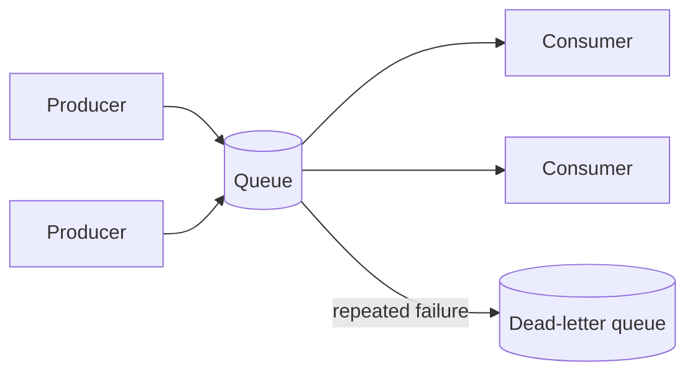

# Queues & async processing
{: .no_toc }

*~8 min read*

**🎯 Interview frequent**

## Why it matters

Not every piece of work belongs in the request/response cycle — sending an email, resizing an image, or updating a search index doesn't need to block the user waiting on a response. Message queues are the standard tool for decoupling "do this now" from "do this eventually," and interviewers use this topic to check whether you understand the guarantees (and lack thereof) that come with going async, not just that "we'll throw it on a queue."

## Core concepts

- **Why decouple producers from consumers.** Calling a downstream service synchronously means your request is only as fast and as available as that dependency — if it's slow or down, so are you. Putting a queue between them lets the producer return immediately after enqueuing, absorbs traffic spikes (the queue buffers work the consumer processes at its own pace), and lets producer and consumer scale, deploy, and fail independently.
- **Delivery guarantees.** *At-most-once*: a message might be lost but is never processed twice — fine for non-critical telemetry. *At-least-once*: a message is never lost but might be processed more than once (common default — the consumer acks after processing, and a crash between processing and acking causes redelivery). *Exactly-once*: no loss, no duplicates — genuinely hard to achieve end-to-end in a distributed system, and most "exactly-once" systems actually deliver at-least-once plus deduplication to *simulate* exactly-once effects.
- **Idempotent consumers make at-least-once safe.** Since most real systems only guarantee at-least-once delivery, consumers need to handle the same message arriving twice without corrupting state — e.g., using a unique message ID to detect and skip duplicates, or designing the operation itself to be safely repeatable (`SET balance = 100` is idempotent; `balance += 10` is not).
- **Queue vs. pub/sub.** A queue (SQS, RabbitMQ) typically delivers each message to exactly one consumer among a pool — good for distributing work across workers. Pub/sub (SNS, Kafka topics with multiple consumer groups) delivers each message to every subscriber independently — good for fanning the same event out to multiple, unrelated downstream systems (e.g., "order placed" triggers billing, inventory, and analytics separately).
- **Ordering guarantees.** Standard queues generally don't guarantee order across the whole queue once you have multiple consumers. FIFO queues (or a single partition/consumer in Kafka) preserve order for a given group of related messages (e.g., all events for one user), but usually at the cost of some throughput, since you can't parallelize processing within that ordered group.
- **Dead-letter queues (DLQs).** Messages that repeatedly fail processing (poison messages, bugs, malformed data) are moved to a separate DLQ after N retries instead of blocking or endlessly retrying the main queue. This isolates bad messages for manual inspection without stalling the rest of the pipeline.
- **Backpressure.** When consumers can't keep up with producers, the queue absorbs the backlog up to its capacity — beyond that, you need an explicit strategy: slow down producers (rate limiting them), scale out consumers, shed load (drop lower-priority messages), or apply a bounded queue that rejects new work once full rather than growing unbounded and risking an out-of-memory failure.

## Mental model

## Interview questions

1. **Why introduce a queue instead of just calling the downstream service directly?**
   Answer: A direct synchronous call ties the caller's availability and latency to the dependency's — if it's slow or down, the caller is too. A queue lets the producer enqueue and return immediately, buffers traffic spikes so the consumer processes at a sustainable rate, and lets the two sides scale and fail independently, at the cost of the work no longer completing before the original request returns.

2. **Why is exactly-once delivery so hard, and how do real systems approximate it?**
   Answer: Guaranteeing a message is delivered and processed exactly once requires coordinating the message delivery and the side effect of processing it as a single atomic unit across separate systems, which distributed systems generally can't do without a shared transaction. Real systems instead provide at-least-once delivery (safe, may duplicate) and make the consumer idempotent (dedupe by message ID, or design the operation to be naturally repeatable), which produces exactly-once *effects* without a literal exactly-once guarantee.

3. **What's a dead-letter queue for, and what happens without one?**
   Answer: It's a holding area for messages that fail processing repeatedly, so they stop blocking or endlessly retrying against the main queue. Without one, a single malformed or bug-triggering "poison message" can either get retried forever (wasting resources, sometimes literally halting an ordered queue behind it) or get silently dropped, losing visibility into a real bug.

4. **How do you make a consumer idempotent, concretely?**
   Answer: Attach a unique ID to each message (or use a naturally unique field like an order ID) and have the consumer check a dedup store (or a unique constraint in the database) before applying the effect — if that ID was already processed, skip it. Alternatively, design the operation itself to be idempotent by construction, like setting an absolute value or using an upsert instead of an increment.

5. **What's the difference between a message queue and a pub/sub system, and when would you use each?**
   Answer: A queue delivers each message to exactly one consumer from a pool, which is right when you want to distribute a set of independent jobs across workers (e.g., image resize jobs). Pub/sub delivers each message to every independent subscriber, which is right when one event needs to trigger multiple unrelated downstream reactions (e.g., an "order placed" event needs to reach billing, inventory, and analytics, each of which should get every event, not compete for it).

6. **How does backpressure work when consumers fall behind producers, and what are your options?**
   Answer: The queue absorbs the growing backlog up to its configured capacity; beyond that, you must actively manage it — scale out more consumers, rate-limit or slow producers, shed lower-priority messages, or configure the queue to reject new writes once full rather than growing unbounded and risking memory exhaustion. Which option is right depends on whether losing/delaying messages or slowing producers is the more acceptable tradeoff for that workload.

## Watch

- [What is a MESSAGE QUEUE and Where is it used?](https://www.youtube.com/watch?v=oUJbuFMyBDk) — Gaurav Sen. Covers the core motivation and use cases for message queues in system design.
- [Kafka vs. RabbitMQ vs. Messaging Middleware vs. Pulsar](https://www.youtube.com/watch?v=x4k1XEjNzYQ) — ByteByteGo. Quick comparison of the major messaging systems and where each fits.

## Further reading

- [Amazon SQS Developer Guide — At-least-once delivery](https://docs.aws.amazon.com/AWSSimpleQueueService/latest/SQSDeveloperGuide/sqs-basic-architecture.html) — official documentation on SQS delivery semantics and DLQs.
- [Apache Kafka Documentation — Delivery Semantics](https://kafka.apache.org/documentation/#semantics) — precise explanation of at-most-once, at-least-once, and exactly-once semantics in Kafka.
