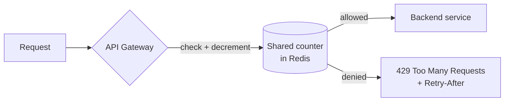

# Rate limiting
{: .no_toc }

*~7 min read*

**🎯 Interview frequent**

## Why it matters

Rate limiting protects a system from abuse, runaway clients, and its own downstream dependencies — and it's a favorite system design question because the "obvious" implementation (a counter in memory) quietly breaks the moment you have more than one server. This topic is also a direct prerequisite for the [distributed rate limiter case study](../14-case-distributed-rate-limiter/) later in this guide.

## Core concepts

- **Token bucket.** A bucket holds up to N tokens, refilled at a fixed rate; each request consumes one token, and requests are rejected when the bucket is empty. Naturally allows short bursts (up to the bucket size) while enforcing a steady long-term rate — the most commonly used algorithm in practice because it balances burst tolerance with simplicity.
- **Leaky bucket.** Requests enter a queue (the "bucket") and are processed at a fixed, constant rate regardless of how bursty the input is — excess requests either queue up or overflow and get dropped. Smooths bursts into a steady output rate, which is useful when the downstream system genuinely can't handle bursts, at the cost of added latency for queued requests.
- **Fixed window counter.** Count requests in a fixed time window (e.g., 100/minute, reset every minute). Simple to implement, but has a boundary problem: a client can send 100 requests at 0:59 and another 100 at 1:00, getting 200 requests in effectively two seconds — double the intended rate.
- **Sliding window (log or counter).** Sliding window *log* tracks the timestamp of every request and counts how many fall within the trailing window — accurate, but memory cost grows with request volume. Sliding window *counter* approximates this cheaply by weighting the previous window's count proportionally to overlap with the current window, avoiding the fixed-window boundary problem without storing every timestamp.
- **Where to enforce limits.** At the client (advisory only, easily bypassed), at an API gateway/edge layer (centralizes the logic, protects everything behind it, and rejects abusive traffic before it consumes backend resources), or per-service (finer-grained, useful for protecting one especially expensive endpoint). Most production systems enforce at the gateway for blanket protection and add per-service limits for specific hot spots.
- **Distributed rate limiting requires shared state.** If each server keeps its own in-memory counter, a client can get N times the intended limit by spreading requests across N servers. The fix is a shared, fast store (typically Redis) with atomic increment-and-check operations (via `INCR` + `EXPIRE`, or a Lua script for correctness under concurrency) so all servers see the same counter.
- **Responding to a limited client.** Return `429 Too Many Requests` with a `Retry-After` header (and often `X-RateLimit-Remaining` / `X-RateLimit-Reset`) so well-behaved clients know exactly when to retry instead of hammering the endpoint immediately again.
- **Multiple granularities at once.** Real systems often need per-user limits (fairness), per-IP limits (abuse from a single source regardless of account), and a global limit (protecting a fragile downstream dependency regardless of who's calling) simultaneously — these are independent checks, not substitutes for each other.

## Mental model

```
Token bucket (capacity 5, refill 1/sec):

  [●●●●●]  --- request arrives, consumes 1 token ---> [●●●●○]
     ^
     | refills 1 token/sec, capped at 5
```



## Interview questions

1. **What's the difference between token bucket and leaky bucket, and when would you prefer each?**
   Answer: Token bucket allows bursts up to the bucket size while enforcing a long-term average rate, which fits most APIs where occasional bursts from a legitimate client are fine. Leaky bucket forces a constant output rate regardless of input burstiness, which fits when the downstream consumer genuinely can't handle spikes and needs smoothed, steady traffic even if that means queuing/delaying burst requests.

2. **What's the boundary problem with fixed window counters, and how does sliding window fix it?**
   Answer: A fixed window resets fully at each boundary, so a client can send a full quota right before the window ends and another full quota right after, achieving roughly double the intended rate in a short span around the boundary. A sliding window (log or weighted counter) considers a continuously moving trailing window instead of discrete resets, so there's no instant at which the count "forgets" recent requests, eliminating the burst-at-the-boundary loophole.

3. **How do you implement rate limiting correctly across multiple stateless application servers?**
   Answer: Move the counter out of each server's local memory into a shared, fast store like Redis, and make the check-and-increment atomic (via `INCR`+`EXPIRE`, or a Lua script executed atomically on the Redis server) so concurrent requests from different app servers can't race past each other and both succeed when only one should have.

4. **What should a rate-limited response look like, and why does it matter?**
   Answer: A `429 Too Many Requests` status with a `Retry-After` header (and ideally `X-RateLimit-Remaining`/`Reset`) tells the client exactly when it's safe to retry, which reduces wasted immediate retries that would otherwise just get rate-limited again — well-behaved clients (and most HTTP client libraries) respect these headers automatically.

5. **How do you prevent the rate limiter's shared store from becoming a bottleneck or single point of failure at high request volume?**
   Answer: Use a fast in-memory store (Redis) that can handle very high throughput for simple atomic operations, shard the counter keys (e.g., by user ID) across a Redis cluster so no single node absorbs all traffic, and consider a two-tier approach — an approximate local counter per app server that syncs periodically to the shared store, trading a little accuracy for far fewer round trips on the hot path.

6. **Why might you need both a per-user rate limit and a global rate limit at the same time?**
   Answer: A per-user limit ensures fairness — no single account can monopolize capacity — but doesn't protect a fragile downstream dependency (a third-party API with its own strict quota) from being overwhelmed by many *different* well-behaved users all within their individual limits simultaneously. A global limit caps total load regardless of who's sending it, and the two checks operate independently and are both necessary for their respective goals.

## Watch

- [Rate Limiter System Design: Token Bucket, Leaky Bucket, Scaling](https://www.youtube.com/watch?v=YXkOdWBwqaA) — ByteByteGo. Covers the main algorithms and how to scale enforcement.
- [Rate Limiting | System Design Interview Basics](https://www.youtube.com/watch?v=qUydEBZmGvU) — ByteMonk. Concise walkthrough aimed directly at interview framing.

## Further reading

- [Stripe Engineering: Scaling your API with rate limiters](https://stripe.com/blog/rate-limiters) — a widely-cited real-world write-up of the algorithms and their tradeoffs in production.
- [Cloudflare Learning: What is rate limiting?](https://www.cloudflare.com/learning/bots/what-is-rate-limiting/) — accessible overview connecting rate limiting to abuse/DDoS mitigation.
