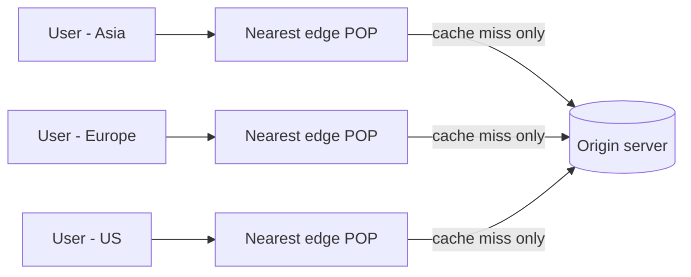

# CDN & edge
{: .no_toc }

*~7 min read*

**Interview occasional**

## Why it matters

Every global-scale system in an interview eventually needs an answer to "how do you serve users on the other side of the world quickly?" — CDNs are that answer, and they're also the piece of infrastructure most engineers use daily without ever configuring one themselves. Understanding what a CDN actually does (and doesn't) do keeps you from treating it as a magic "make it fast" box.

## Core concepts

- **What a CDN does.** A Content Delivery Network caches content at edge servers (points of presence, or POPs) geographically distributed close to end users, so a request is served from a nearby edge node instead of traveling all the way to the origin server. This cuts latency (shorter network path) and reduces origin load (the origin only needs to serve edge nodes on a cache miss, not every end user).
- **Pull vs. push CDN.** A pull CDN fetches and caches content from the origin lazily, on the first request for that content from a given region — simple to set up, but the first user in each region pays a cache-miss penalty. A push CDN has content proactively uploaded/synced to edge nodes ahead of time — no first-request penalty, but requires you to manage what's pushed and when, so it's typically used for content you know in advance needs to be everywhere (e.g., a major software release).
- **Cache-Control and TTLs.** The origin tells the CDN (and browsers) how long content is cacheable via HTTP headers like `Cache-Control: max-age=3600`. Static assets (images, JS/CSS bundles, especially ones with a content hash in the filename) can have very long TTLs since they never change in place; dynamic or personalized content needs short TTLs or `no-store` — this is the same TTL/staleness tradeoff from [caching](../04-caching/), applied at the network edge.
- **Cache invalidation at the edge.** Because content may be cached at hundreds of POPs, invalidating it everywhere isn't instant. The common pattern is versioned/immutable URLs (append a content hash or version number to the filename, so "updating" content means changing the URL, not invalidating the old one) rather than relying on purge APIs, which are slower and eventually-consistent across POPs.
- **CDNs increasingly cache and even compute dynamic content.** Beyond static files, CDNs support caching personalized or frequently-changing responses with careful cache-key design (e.g., vary cache by user segment, not per-user), and "edge compute" platforms (Cloudflare Workers, Lambda@Edge) let you run actual application logic at the edge — authentication checks, A/B test routing, even full request handling — blurring the line between "CDN" and "distributed application layer."
- **Anycast routing.** Many CDNs advertise the same IP address from every POP using BGP anycast, so network routing itself sends a user's request to the topologically nearest POP without any application-level geo-lookup — this is also the mechanism behind global load balancing (see [load balancing](../03-load-balancing/)).
- **DDoS absorption as a side benefit.** Because a CDN's edge network has far more aggregate capacity than a single origin, and it can absorb/filter malicious traffic at the edge before it ever reaches the origin, CDNs are commonly used as a first line of defense against volumetric attacks, independent of their caching role.

## Mental model

## Interview questions

1. **How does a CDN route a user to the nearest edge server?**
   Answer: Most CDNs use anycast — the same IP address is advertised from every edge location via BGP, and normal internet routing naturally delivers the user's request to whichever POP is topologically closest, with no application-level geolocation lookup needed. Some CDNs additionally or alternatively use DNS-based routing, resolving the CDN hostname to a different IP per region based on the resolver's location.

2. **Pull vs. push CDN — what's the practical tradeoff?**
   Answer: Pull CDNs cache content lazily on first request per region, which is zero-maintenance but means the very first user in a new region pays a cache-miss latency penalty. Push CDNs have content proactively distributed ahead of demand, avoiding that penalty entirely, but require you to actively manage and trigger the push, making it worthwhile mainly for content you know in advance will be in high, immediate demand everywhere.

3. **How do you invalidate a cached asset across a CDN's edge network?**
   Answer: The preferred approach is avoiding invalidation altogether by using versioned/immutable URLs (a content hash or version in the filename) — "updating" content just means the app starts referencing a new URL, and the old cached version harmlessly ages out. Purge APIs exist for cases where you can't version the URL, but they're slower and can take time to propagate consistently across every POP.

4. **Can a CDN cache dynamic or personalized content, and what's the catch?**
   Answer: Yes, but the cache key has to be designed carefully — caching per-user personalized responses under a single shared key would leak one user's content to another, so you either vary the cache by a coarse segment (e.g., logged-out vs. logged-in, or by locale) rather than per-user, or use short TTLs with edge compute to personalize a cached base response on the fly.

5. **How does a CDN help mitigate a DDoS attack, independent of caching?**
   Answer: The CDN's edge network has aggregate capacity far larger than a single origin server, and traffic hits the edge first — malicious volumetric traffic gets absorbed and filtered across many distributed POPs before it ever reaches the origin, so the origin only sees a fraction of the attack traffic (or none, if it's fully filtered at the edge).

6. **What is "edge compute" and how does it change what a CDN is for?**
   Answer: Edge compute platforms (Cloudflare Workers, Lambda@Edge) let you run actual application code at the same distributed edge locations that used to just cache static files — meaning logic like auth checks, request rewriting, or A/B routing can execute close to the user instead of round-tripping to a central origin, turning the CDN from a passive cache into a distributed layer of the application itself.

## Watch

- [What is a Content Delivery Network (CDN)?](https://www.youtube.com/watch?v=Bsq5cKkS33I) — IBM Technology. Clear introduction to what CDNs solve and how edge caching works.
- [What Is A CDN? How Does It Work?](https://www.youtube.com/watch?v=RI9np1LWzqw) — ByteByteGo. Fast, visual walkthrough of the request path through a CDN.

## Further reading

- [Cloudflare Learning: What is a CDN?](https://www.cloudflare.com/learning/cdn/what-is-a-cdn/) — accessible vendor explainer covering POPs, anycast, and caching behavior.
- [MDN: HTTP Caching (Cache-Control)](https://developer.mozilla.org/en-US/docs/Web/HTTP/Caching) — authoritative reference on the headers that control CDN and browser caching behavior.
