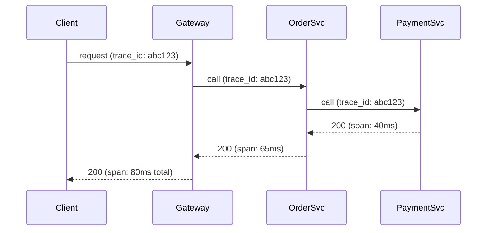

# Observability
{: .no_toc }

*~7 min read*

**Interview occasional**

## Why it matters

A system you can't observe is a system you can only debug by guessing. Observability questions show up less often as a standalone interview topic than as a follow-up — "how would you know if this was slow/broken in production?" — and answering well signals that you think about a design past the point where it first works, into the point where someone has to operate it at 3am.

## Core concepts

- **The three pillars: metrics, logs, traces.** *Metrics* are numeric time-series (request rate, error rate, p99 latency) — cheap to store and great for dashboards/alerting on trends, but they tell you *that* something is wrong, not *why*. *Logs* are discrete, timestamped events with arbitrary detail — great for understanding exactly what happened for one specific request, but expensive to store/search at volume. *Traces* follow a single request as it moves across multiple services, showing where time was spent at each hop — essential once a request touches more than one service.
- **Distributed tracing and context propagation.** A trace is made of spans (one per service/operation), linked by a shared trace ID that's generated at the entry point and propagated through every downstream call (usually via an HTTP header). Without this propagation, you get isolated logs per service with no way to reconstruct which log lines belong to the same end-to-end request — context propagation is the mechanism that makes tracing possible at all.
- **SLIs, SLOs, and error budgets.** An SLI (Service Level Indicator) is a measured metric (e.g., "% of requests under 200ms"). An SLO (Service Level Objective) is a target for that metric (e.g., "99.9% of requests under 200ms over 30 days"). An SLA (Service Level Agreement) is the SLO with a contractual/business consequence attached. The gap between 100% and your SLO is your error budget — see [scalability & availability](../01-scalability-availability/) for how that budget gets spent.
- **Alert on symptoms, not causes.** Alert on things users actually experience — elevated error rate, high latency, failed requests — rather than internal signals like CPU or memory usage in isolation. High CPU might be totally fine (efficient use of provisioned capacity); a rising error rate is never fine. Symptom-based alerts also survive infrastructure changes (a new caching layer might legitimately change CPU patterns without meaning anything is broken).
- **Structured logging and correlation IDs.** Logging structured fields (JSON with explicit keys like `user_id`, `request_id`, `latency_ms`) instead of free-text strings makes logs machine-queryable — you can filter/aggregate instead of grepping. A correlation/request ID threaded through every log line for a given request (and ideally matching the trace ID) lets you pull every log line related to one request across every service it touched.
- **Cardinality is the hidden cost of both metrics and logs.** A metric label (or log field) with unbounded unique values — like `user_id` as a metric label — multiplies the number of distinct time series the monitoring system has to store, and can silently overwhelm a metrics backend that was sized for a few hundred label combinations, not millions. High-cardinality data belongs in logs/traces (which are built for arbitrary detail) rather than metrics (which are built for aggregation).

## Mental model

One trace ID, propagated through every hop, stitches together the spans that show exactly where the 80ms went.

## Interview questions

1. **What's the difference between metrics, logs, and traces, and when do you reach for each?**
   Answer: Metrics are aggregated numeric trends, best for dashboards and alerting on "is something wrong right now" at low storage cost. Logs are detailed, discrete records of individual events, best for understanding exactly what one specific request or process did. Traces follow a single request across service boundaries, best for pinpointing *where* in a multi-service call chain time was spent or a failure occurred. In practice you often start at a metric alert, drill into traces to find the slow hop, then read logs from that specific service for full detail.

2. **How does a distributed trace actually get stitched together across services?**
   Answer: A trace ID is generated at the request's entry point and propagated as context (typically an HTTP header) through every downstream call the request triggers; each service creates its own span tagged with that shared trace ID and reports it to a tracing backend, which reconstructs the full call tree by grouping spans with the same trace ID. Without deliberately propagating that ID through every hop, each service's telemetry is an isolated island with no way to reconnect them.

3. **Define SLI, SLO, and SLA, and how they relate.**
   Answer: An SLI is the actual measured indicator (e.g., request success rate). An SLO is the target you set for that indicator (e.g., 99.9% success over 30 days). An SLA is that same target formalized with a business/contractual consequence for missing it (e.g., a service credit). SLOs are typically set stricter than the SLA to leave margin, since you want to notice and react before you actually breach a contractual promise.

4. **Why is alerting on symptoms better than alerting on causes like CPU usage?**
   Answer: Symptoms (error rate, latency, failed requests) directly reflect what users experience, so an alert firing means something is actually worth waking someone up for. Cause-based metrics like CPU are ambiguous — high CPU can be totally healthy (efficient use of capacity) or a real problem, depending on context — leading to noisy alerts that get ignored, and cause-based alerts also don't adapt automatically when the underlying architecture changes.

5. **Why can high-cardinality labels on a metric cause an outage in your monitoring system itself?**
   Answer: Each unique combination of label values creates a distinct time series that the metrics backend has to store and index; a label like `user_id` or a raw URL with embedded IDs can produce millions of unique series, which can exhaust the memory/storage the monitoring system was provisioned for, potentially taking down or badly degrading the very system you rely on to observe outages. High-cardinality data belongs in logs or trace attributes instead, which are designed for that.

6. **You get paged for a slow endpoint that calls through five microservices. Walk through how you'd find the cause.**
   Answer: Start with the trace for a representative slow request to see which of the five services (or which specific span) accounts for most of the elapsed time — this narrows the search from "somewhere in five services" to one or two. Then pull structured logs for that specific service, filtered by the request/correlation ID from the trace, to see exactly what it was doing during that span (e.g., a slow downstream call, a lock wait, a retry loop). Cross-check the relevant service's own metrics dashboard (its dependency latency, error rate) to confirm whether the slowness is isolated to this request or a broader degradation.

## Watch

- [Observability vs. APM vs. Monitoring](https://www.youtube.com/watch?v=CAQ_a2-9UOI) — IBM Technology. Clarifies how observability relates to (and differs from) traditional monitoring and APM.
- [Exploring logs, metrics, and traces with Grafana | Grafana for Beginners Ep. 7](https://www.youtube.com/watch?v=1q3YzX2DDM4) — Grafana. Hands-on look at how the three pillars work together in a real observability stack.

## Further reading

- [Google SRE Book — Monitoring Distributed Systems](https://sre.google/sre-book/monitoring-distributed-systems/) — the canonical reference on symptom-based alerting and the four golden signals.
- [OpenTelemetry Documentation](https://opentelemetry.io/docs/concepts/signals/) — vendor-neutral standard reference defining metrics, logs, and traces as first-class signals.
