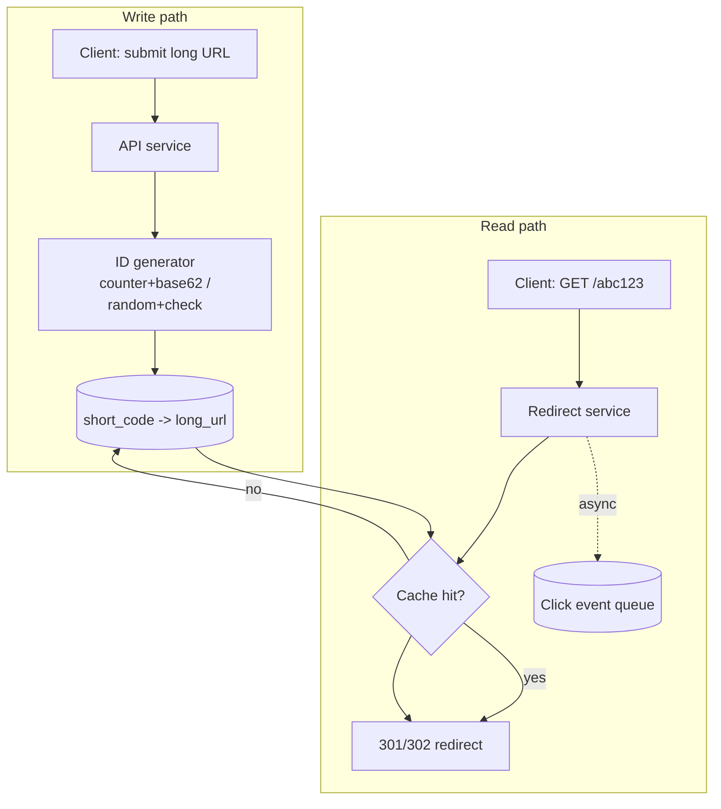

# Case study: URL shortener
{: .no_toc }

*~8 min read*

**🎯 Interview frequent**

## Why it matters

The URL shortener is the "hello world" of system design interviews — small enough to fully design in 30-45 minutes, but it touches ID generation, read/write asymmetry, and caching in a way that reveals whether you can size a system and make concrete tradeoffs instead of hand-waving. It's a good first case study precisely because most of what makes it interesting is *not* the URL shortening itself.

## Core concepts

- **Functional requirements.** Given a long URL, return a short one (e.g., `sho.rt/abc123`); given a short URL, redirect to the original long URL; support optional custom aliases and optional expiration.
- **Non-functional requirements and the key insight.** Reads (redirects) vastly outnumber writes (new short links) — often 100:1 or more, since one shortened link gets clicked many times. This ratio should drive almost every subsequent decision: optimize the read path aggressively, and don't over-engineer the write path.
- **Back-of-envelope sizing.** If the service handles ~100M new URLs/month, that's roughly 40 writes/sec average. At a 100:1 read:write ratio, that's ~4,000 reads/sec average — the number that actually determines your scaling strategy. Storage: 100M URLs/month × ~500 bytes/record × a few years of retention lands in the tens-to-low-hundreds of GB — small enough that storage capacity is a non-issue; the redirect *latency and throughput* is the real design constraint.
- **ID generation approaches.** *Counter + base62 encoding*: a monotonically increasing counter (or a range of IDs pre-allocated per server to avoid a shared-counter bottleneck), encoded in base62 (a-z, A-Z, 0-9) to keep short codes compact — simple and collision-free, but reveals approximate creation order/volume. *Random string + collision check*: generate a random short code and check the database for a collision, retrying on conflict — no shared counter needed, but adds a check-then-write step and a (small, tunable) chance of retries. A distributed ID generator (Snowflake-style, embedding timestamp + machine ID) avoids a single shared counter without random collisions, at the cost of slightly more infrastructure.
- **Data model.** A simple key-value mapping — `short_code -> long_url` (plus metadata like created_at, expires_at, owner) — fits a key-value or document store well, since the access pattern is always a single-key lookup, never a join (see [SQL vs NoSQL](../05-sql-vs-nosql/)).
- **High-level architecture.** *Write path*: client submits a long URL → service generates/validates a short code → write to the datastore → return the short URL. *Read path*: client hits the short URL → service looks up the long URL by short code (cache first, see [caching](../04-caching/)) → issue an HTTP redirect (301 for permanent, cacheable by browsers; 302 if you need every click to hit your server, e.g., for click analytics).
- **Caching the hot path.** Since reads dominate and link popularity is typically skewed (a small number of links get most of the clicks), a cache (Redis, or even an in-process LRU cache per redirect server) in front of the datastore absorbs the large majority of read traffic, leaving the database to handle mostly cache misses for long-tail links.
- **Click analytics as an async concern.** Recording click events (timestamp, referrer, geography) for analytics shouldn't block the redirect response — publish an event to a queue (see [queues & async processing](../07-queues-async/)) and let a separate consumer aggregate it, so a slow analytics pipeline can never slow down the actual redirect.

## Mental model

## Interview questions

1. **How would you generate short codes, and what's the tradeoff between a counter-based and a random approach?**
   Answer: Counter + base62 is simple and collision-free by construction, but a single shared counter can become a write bottleneck and reveals volume/order information; pre-allocating ID ranges per server avoids the bottleneck. Random generation + collision check needs no shared state and doesn't leak ordering, but each write may need one or more collision-check round trips, and collision probability needs to be kept low via sufficient code length/entropy.

2. **Why is this system read-heavy, and how does that shape your design?**
   Answer: Every shortened URL gets created once but clicked many times, often skewed toward a small number of popular links (a long-tail distribution). That pushes the design toward aggressively caching the read path and choosing a redirect status/architecture optimized for low read latency, while the write path — comparatively rare — can afford a bit more overhead (e.g., a collision check, or writing to a queue for async indexing).

3. **How do you handle custom aliases and collisions with them?**
   Answer: When a user requests a custom alias, check for existing use with a uniqueness constraint (or lookup) on the short_code column/key before accepting it, and reject (or suggest alternatives) on conflict — this is a straightforward existence check because, unlike randomly generated codes, there's no "just try again with different randomness" fallback; the user asked for that specific string.

4. **Where would you cache in this system, and why there specifically?**
   Answer: In front of the short_code → long_url lookup on the read path, since that's the operation executed on every single redirect and the data (once created) essentially never changes — a near-ideal caching candidate (high read:write ratio, low mutation rate). A CDN could also cache the redirect response itself for anonymous, non-analytics-tracked redirects, pushing the hot path even closer to the user.

5. **How would you scale the redirect service to handle very high QPS?**
   Answer: Keep the redirect service itself stateless and horizontally scaled behind a load balancer (see [load balancing](../03-load-balancing/)), push the hot lookup into a distributed cache so most requests never touch the primary datastore, and shard the underlying datastore by short_code hash if it ever becomes the bottleneck (see [partitioning & sharding](../06-partitioning-sharding/)) — though given the data size involved, caching alone usually gets you very far before sharding is even necessary.

6. **How would you support link expiration?**
   Answer: Store an `expires_at` field alongside each mapping, and check it on read — either lazily (the redirect service checks expiry on lookup and returns a 404/410 if expired, and a periodic background job cleans expired rows out of the datastore) or via the datastore's native TTL support if it has one (e.g., Redis or DynamoDB TTL), which handles both the storage cleanup and avoids relying solely on read-time checks.

## Watch

- [How Does a URL Shortener Work?](https://www.youtube.com/watch?v=HHUi8F_qAXM) — ByteByteGo. Compact walkthrough of ID generation and the read/write split.
- [Beginner System Design Interview: Design Bitly w/ a Ex-Meta Staff Engineer](https://www.youtube.com/watch?v=iUU4O1sWtJA) — Hello Interview. Full mock-interview-style design session covering requirements through scaling.
