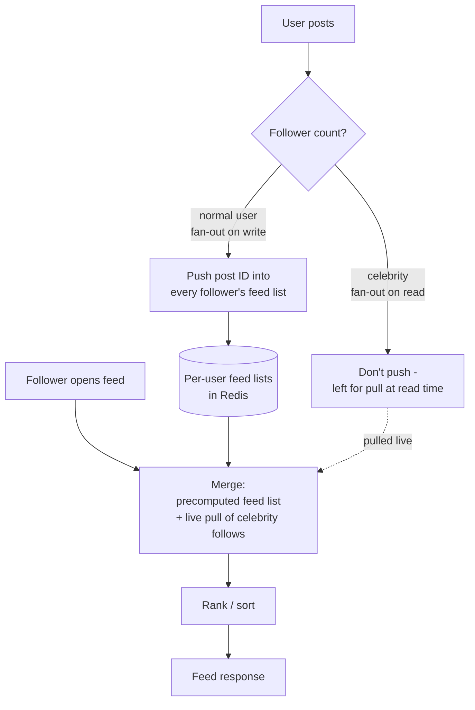

# Case study: news feed
{: .no_toc }

*~9 min read*

**🎯 Interview frequent**

## Why it matters

A news feed (Facebook/Twitter/Instagram-style "posts from people you follow, newest or most relevant first") is one of the most commonly asked case studies because it forces a real fan-out decision with no clean answer — and interviewers specifically watch for whether you notice the celebrity/hot-user edge case that breaks the naive approach.

## Core concepts

- **Functional requirements.** Users can post content and follow other users; each user has a feed showing posts from everyone they follow, ordered by recency (or a ranking model, in a more advanced version).
- **Non-functional requirements.** Feed reads happen far more often than posts are written (users check their feed repeatedly; most users post rarely), low read latency matters a lot (feed load is a core, frequent interaction), and some staleness is acceptable — nobody notices if a post you just published takes a few seconds to appear in a follower's feed (see [CAP theorem & consistency models](../02-cap-consistency/): this is squarely an AP-leaning workload).
- **Fan-out on write ("push").** When a user posts, immediately push that post into the precomputed feed (e.g., a Redis list) of every follower. Feed reads become a fast, single lookup of an already-assembled list — great for read latency, but a single post from a user with millions of followers means millions of writes at once, and most of that fan-out work may be wasted if a given follower never opens the app.
- **Fan-out on read ("pull").** Don't precompute anything; when a user opens their feed, query posts from everyone they follow and merge them on the fly. Writes stay cheap regardless of follower count, but reads get expensive — querying and merging across potentially thousands of followed accounts on every single feed load, which is exactly backwards from the read-heavy access pattern this system actually has.
- **Hybrid fan-out — the answer that actually ships.** Use fan-out-on-write for most users (whose follower counts are small enough that pushing is cheap), and fan-out-on-read for celebrity/high-follower-count accounts (fan out to millions on every post would be prohibitively expensive and mostly wasted). A user's final feed is assembled by merging their precomputed pushed feed with a live pull of the small number of celebrity accounts they follow — this avoids both the write storm and the expensive full pull.
- **Storage for precomputed feeds.** Each user's feed is typically a bounded, capped list (e.g., the most recent ~1000 post IDs) stored in a fast key-value/list store (Redis), not a full copy of post content — the feed stores references, and the actual post content is fetched from a separate posts store/cache by ID, avoiding duplicating large content across every follower's feed.
- **Ranking is a separable concern.** Simple recency ordering (a sorted list by timestamp) is the baseline; a ranking model (engagement prediction, recency decay, diversity) can be layered on as a separate scoring/re-ranking step over the candidate posts, so the fan-out/storage architecture doesn't need to change just because ranking logic gets more sophisticated later.
- **Cursor-based pagination.** Because the underlying feed keeps changing (new posts arriving) while a user scrolls, offset-based pagination ("give me items 20-40") can skip or duplicate items as the list shifts underneath. Cursor-based pagination (return an opaque pointer — typically the last seen post's ID/timestamp — and ask for "everything after this cursor") stays correct regardless of concurrent inserts.

## Mental model

## Interview questions

1. **Explain fan-out on write vs. fan-out on read, and the core tradeoff between them.**
   Answer: Fan-out on write pushes a new post into every follower's precomputed feed immediately at post time, making reads cheap (a single lookup) at the cost of expensive, potentially wasted writes proportional to follower count. Fan-out on read defers all the work to read time, merging posts from followed accounts on demand — writes stay cheap regardless of follower count, but reads become expensive and slow exactly where this system needs to be fast, since feed reads vastly outnumber posts.

2. **How do you handle a celebrity account with millions of followers without every post triggering millions of writes?**
   Answer: Use a hybrid approach — skip fan-out-on-write for accounts above a follower-count threshold, and instead pull their posts live at read time, merging them into the follower's normal precomputed feed. This bounds the fan-out cost for any single post to the (much smaller) set of normal accounts a user follows, while still surfacing celebrity posts by fetching the small number of celebrity accounts a given user follows directly.

3. **How do you paginate a feed that keeps changing while the user scrolls?**
   Answer: Use cursor-based pagination — the client passes back an opaque cursor (typically the ID or timestamp of the last item it saw) and asks for the next batch strictly after that point, rather than an offset/page number. This avoids the skip/duplicate bugs that offset pagination produces when new items are inserted at the top of a list while someone is actively paging through it.

4. **Where does ranking fit into this architecture?**
   Answer: As a distinct step applied to a candidate set of posts (the merged precomputed-feed-plus-celebrity-pull result) right before returning the response — a separate scoring service or logic layer that can start as simple recency-sort and evolve into an ML-based engagement model without requiring changes to how posts are stored or fanned out underneath it.

5. **This system is eventually consistent — why is that an acceptable design choice here?**
   Answer: A few seconds of delay before a new post appears in followers' feeds is unnoticeable in normal usage and has no correctness consequence (unlike, say, a financial balance) — users aren't comparing timestamps against some absolute truth, they're just scrolling a feed. Choosing availability and low latency over strict consistency (an AP-leaning choice) is the right tradeoff because the cost of occasional staleness is near zero and the cost of slow/unavailable feeds is high (bad UX, directly felt on every interaction).

6. **How would you scale storage for millions of users' precomputed feed lists?**
   Answer: Store each feed as a bounded-length list (cap at the most recent N post IDs, not full content) in a horizontally sharded key-value store like Redis Cluster, sharded by user ID — this keeps each feed small and bounded regardless of how long a user has been active, and shards independently since a feed lookup is always scoped to one user (see [partitioning & sharding](../06-partitioning-sharding/)). Actual post content lives separately, keyed by post ID, so it's stored once and referenced by every follower's feed rather than duplicated.

## Watch

- [Design FB News Feed System Design Interview w/ ex: Meta Senior Manager](https://www.youtube.com/watch?v=Qj4-GruzyDU) — Hello Interview. Full design session covering fan-out strategy and the celebrity-user edge case.
- [Design Twitter - System Design Interview](https://www.youtube.com/watch?v=o5n85GRKuzk) — NeetCode. Covers the timeline/feed generation problem with a similar push/pull framing.
