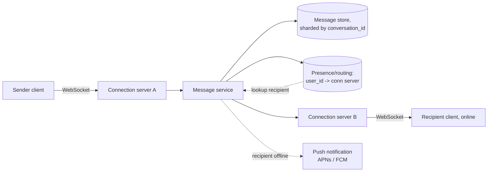

# Case study: chat / messaging
{: .no_toc }

*~9 min read*

**🎯 Interview frequent**

## Why it matters

Designing a chat system (WhatsApp/Messenger/Slack-style) is one of the few case studies that forces a real conversation about persistent connections and delivery guarantees, rather than the usual request/response CRUD flow — it's a good test of whether you can reason about state that lives across requests, not just within one.

## Core concepts

- **Functional requirements.** 1:1 and group messaging, message delivery and read receipts, online/offline presence, and retrievable message history when a user opens or scrolls a conversation.
- **Non-functional requirements.** Low delivery latency for online recipients, guaranteed eventual delivery for offline recipients, ordering preserved within a single conversation, and durability — a message, once accepted by the server, must not be lost even if the recipient is offline for days.
- **Persistent connections, not polling.** HTTP polling (repeatedly asking "any new messages?") wastes resources and adds latency proportional to the poll interval. A WebSocket (or long-lived connection) held open between each online client and a connection server lets the server push messages the instant they arrive, which is essential for a chat product where perceived instantness is the whole point.
- **Connection servers and routing.** A fleet of connection servers each hold a large number of open WebSocket connections; because a sender and recipient can be connected to *different* connection servers, the system needs a presence/routing layer (often backed by a fast key-value store like Redis) mapping `user_id -> which connection server they're currently on`, so a message can be routed to the right server to reach its recipient.
- **Message flow.** Sender's client sends a message over its WebSocket to its connection server → the connection server hands it to a message service, which persists it durably and looks up the recipient's current connection server via the presence/routing layer → the message is forwarded to that server → pushed down the recipient's open WebSocket if they're online. If the recipient is offline, the message is already durably stored and gets delivered (or its unread count updated) the next time they connect, plus optionally triggers a push notification via APNs/FCM.
- **Ordering guarantees per conversation.** Assign each message a per-conversation sequence number (or a tightly ordered timestamp) at write time, so clients can always render messages in the correct order and detect gaps (a missing sequence number signals a message that hasn't arrived yet, prompting a resync) — this is a narrower, more tractable ordering problem than global ordering, since it only needs to hold within one conversation (see [queues & async processing](../07-queues-async/) for the general ordering-guarantee tradeoff).
- **Storage sharded by conversation.** Messages are naturally partitioned by conversation ID — nearly every query ("give me the last 50 messages in this conversation") is scoped to one conversation, making conversation ID a clean, hotspot-resistant shard key (see [partitioning & sharding](../06-partitioning-sharding/)), unlike sharding by sender or recipient, which would scatter a single conversation's messages across many shards.
- **Read receipts without doubling write load.** Naively writing a "read" event to the database for every message a user reads would multiply write volume. Instead, track only the *latest read sequence number* per user per conversation (one small, frequently-overwritten value, not one row per message) — a client that's read up to sequence #142 has implicitly read everything before it too, so there's no need to record each message's read state individually.

## Mental model

## Interview questions

1. **Why use WebSockets instead of HTTP polling for this system?**
   Answer: Polling introduces latency bounded by the poll interval and wastes resources on requests that usually find nothing new, especially at scale across millions of idle connections. A WebSocket keeps a connection open so the server can push a message to the client the instant it arrives, which matches what users actually expect from a chat product — near-instant delivery — without the overhead of constant re-polling.

2. **A message needs to reach a recipient connected to a different server than the sender. How does that routing work?**
   Answer: A presence/routing layer (typically Redis) maintains a mapping of `user_id -> current connection server`, updated whenever a user connects or disconnects. When the message service needs to deliver to a recipient, it looks up which connection server currently holds that user's live connection and forwards the message there for final delivery over that server's WebSocket to the client.

3. **How do you guarantee message ordering within a single conversation?**
   Answer: Assign each message a monotonically increasing sequence number scoped to its conversation at write time (rather than relying on client-reported timestamps, which can be skewed or out of order due to network delays). Clients render messages by sequence number and can detect a gap in the sequence as a signal to resync/re-fetch, rather than assuming whatever arrives last is actually last.

4. **How do you handle message delivery to an offline recipient?**
   Answer: The message is durably persisted by the message service regardless of the recipient's online status, so nothing is lost. If the recipient is offline, the system optionally triggers a push notification (APNs/FCM) to alert them, and when they next connect, their client fetches everything after the last sequence number it has seen for each conversation, catching up naturally through the same mechanism used for normal history loading.

5. **Why is conversation ID a good shard key for message storage, and what would go wrong with a different choice?**
   Answer: Nearly every read query is scoped to one conversation ("last N messages in this thread"), so sharding by conversation ID keeps each query hitting a single shard and keeps a conversation's messages physically co-located and easy to order/paginate. Sharding by sender or recipient ID instead would scatter a single conversation's messages across multiple shards (since a conversation has at least two participants with different IDs), turning every message-history read into an expensive cross-shard fan-out.

6. **How do you implement read receipts without a write per message read?**
   Answer: Store just one value per (user, conversation) pair — the highest sequence number that user has read — and update it in place as they read further, rather than writing a row per message acknowledging it was read. Since sequence numbers are ordered, "read up to #142" implies every earlier message in that conversation was read too, so the write volume stays proportional to how often a user checks a conversation, not how many messages are in it.

## Watch

- [FAANG System Design Interview: Design A Chat System (WhatsApp, Facebook Messenger, Discord, Slack)](https://www.youtube.com/watch?v=okrR1KXNLtA) — ByteByteGo. Covers connection handling, routing, and storage for a chat system end to end.
- [WHATSAPP System Design: Chat Messaging Systems for Interviews](https://www.youtube.com/watch?v=vvhC64hQZMk) — Gaurav Sen. Deep dive into message delivery guarantees and architecture tradeoffs.
