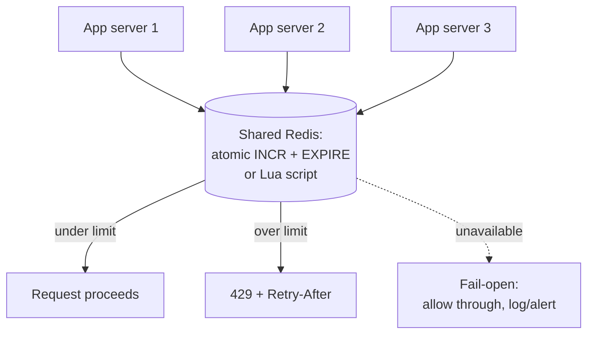

# Case study: distributed rate limiter
{: .no_toc }

*~8 min read*

**🎯 Interview frequent**

## Why it matters

This case study takes the algorithms from [rate limiting](../08-rate-limiting/) and forces the question interviewers actually care about: how do you enforce one coherent limit across a fleet of stateless servers that don't talk to each other? It's a compact but genuinely tricky distributed-systems problem, which makes it a favorite for testing whether "shared state" clicks as a concept, not just a buzzword.

## Core concepts

- **Functional requirement.** Enforce a rate limit per key (per user, per API key, or per IP) consistently, regardless of which of your many stateless application servers happens to handle any given request.
- **Non-functional requirements.** The limiter check must add minimal latency to the request path (it runs on every request), must be accurate enough to be meaningful without necessarily being perfectly exact, and — critically — its own availability shouldn't take down the service it's protecting.
- **Why local, in-memory counters don't work.** If each app server tracks its own counter for a key, a client can get roughly N times the intended limit simply by having its requests land on N different servers (via the load balancer) — the whole point of the limit (a global cap on that key) is violated the moment there's more than one server, which there always is in a horizontally scaled system (see [scalability & availability](../01-scalability-availability/)).
- **Centralized shared store.** The standard fix is a fast, shared store — almost always Redis — that every app server checks against, so there's exactly one source of truth for each key's count regardless of which server handles the request.
- **Atomicity is the crux of correctness.** A naive "read the counter, check if under limit, then increment" sequence has a race condition — two concurrent requests can both read the same under-limit value and both proceed, exceeding the intended limit. The fix is making check-and-increment a single atomic operation: Redis's `INCR` (atomic by default) combined with `EXPIRE` for window reset, or a small Lua script executed atomically on the Redis server for algorithms (like sliding window) that need more than one operation to stay consistent.
- **Sliding window counter as the practical algorithm.** A true sliding window log (storing every request timestamp) is accurate but memory-expensive at scale. The sliding window *counter* approximates it cheaply: keep a count for the current fixed window and the previous one, and weight the previous window's count by how much it overlaps the trailing window you actually care about. This avoids the fixed-window boundary-burst problem (see [rate limiting](../08-rate-limiting/)) at a fraction of the memory cost of storing every timestamp — "good enough" accuracy is the right tradeoff here, not perfect precision.
- **Fail-open vs. fail-closed.** If the shared Redis store becomes unavailable, you must decide: fail-open (allow all requests through, un-rate-limited) or fail-closed (reject all requests until the store recovers). Fail-open is usually preferred for a rate limiter specifically, because the limiter's job is to protect against abuse/overload, not to be a hard security boundary — an outage in the limiter shouldn't take down the entire protected service; the small risk window of unlimited traffic during a rare limiter outage is generally more acceptable than a full service outage.
- **Two-tier limiting to reduce hot-path load.** Checking a centralized store on every single request adds a network round trip to every request. A common optimization is a local, approximate counter on each app server that only periodically syncs with (or occasionally checks against) the central store — trading a small amount of enforcement precision (a brief window where the true global count could be slightly exceeded) for a large reduction in per-request latency and load on the shared store.
- **Multiple simultaneous granularities.** As in [rate limiting](../08-rate-limiting/), a real deployment often layers a per-user limit, a per-IP limit, and a global limit — each is a separate key/counter in the shared store, checked independently, since they protect against different failure modes (one abusive account, one abusive source IP regardless of account, and total load on a fragile downstream dependency).

## Mental model

## Interview questions

1. **Why doesn't a per-server in-memory counter work for rate limiting in a horizontally scaled system?**
   Answer: Each server only sees the requests that land on it, not the client's total request volume across the whole fleet — a client can trivially exceed the intended limit by having a load balancer spread its requests across multiple servers, each of which independently thinks the client is well within its own local limit.

2. **How do you make the check-and-increment operation atomic in a shared store like Redis?**
   Answer: Use Redis's native atomic operations directly — `INCR` on a key is atomic by itself, paired with `EXPIRE` to reset the window — or, for algorithms needing multiple related reads/writes to stay consistent (like a sliding window counter spanning two window buckets), execute the whole sequence as a single Lua script on the Redis server, which Redis guarantees runs atomically with no other command interleaving.

3. **Explain how a sliding window counter works and why it's considered "good enough" compared to a sliding window log.**
   Answer: It tracks a count for the current fixed window plus the count from the immediately previous window, and estimates the trailing-window total by weighting the previous window's count proportionally to how much of it still falls within the current sliding interval. This avoids storing every individual request timestamp (which a true sliding log requires and which gets expensive at high volume), at the cost of being an approximation rather than an exact count — a tradeoff that's acceptable because rate limits are inherently a soft protective mechanism, not a value requiring exact precision.

4. **If the Redis store backing your rate limiter goes down, should the system fail open or fail closed? Why?**
   Answer: Generally fail-open — let requests through un-limited rather than reject everything — because the rate limiter's purpose is to protect the service from excess load or abuse, and an outage in that protective layer shouldn't become an outage of the entire service it's protecting. The exception is when the limiter is also acting as a hard security control (e.g., preventing credential-stuffing attempts), where the cost-benefit of temporarily blocking legitimate traffic may be judged worth it — but that's a deliberate, explicit choice, not the default.

5. **How do you keep the shared rate-limiter store from becoming a bottleneck at very high request volume?**
   Answer: Shard the counters themselves across a Redis cluster (e.g., by hashing the rate-limit key) so no single node absorbs all the traffic, and/or introduce a two-tier scheme where each app server keeps a local approximate counter and only periodically syncs to or checks the central store instead of round-tripping on every single request — accepting a small amount of enforcement slack in exchange for a large reduction in load on the shared store.

6. **How would you support a per-user limit and a global limit on the same endpoint simultaneously?**
   Answer: Treat them as two independent checks against two independent keys in the same shared store — e.g., `ratelimit:user:{id}` and `ratelimit:global:{endpoint}` — and require the request to pass both checks (each atomically incremented and checked) before proceeding; failing either one results in a 429. They're not substitutes for each other, since they protect against different scenarios (one user hammering the API vs. total aggregate load regardless of source).

## Watch

- [Design a Distributed Rate Limiter w/ a Ex-Meta Staff Engineer: System Design Breakdown](https://www.youtube.com/watch?v=MIJFyUPG4Z4) — Hello Interview. Full design walkthrough covering shared-state enforcement and fail-open/closed tradeoffs.
- [System Design Mock Interview: Design a Rate Limiter (with Meta Engineering Manager)](https://www.youtube.com/watch?v=SgWb6tWx3S8) — Aced (formerly Exponent). Live mock interview format showing how to reason through the design under interview conditions.
